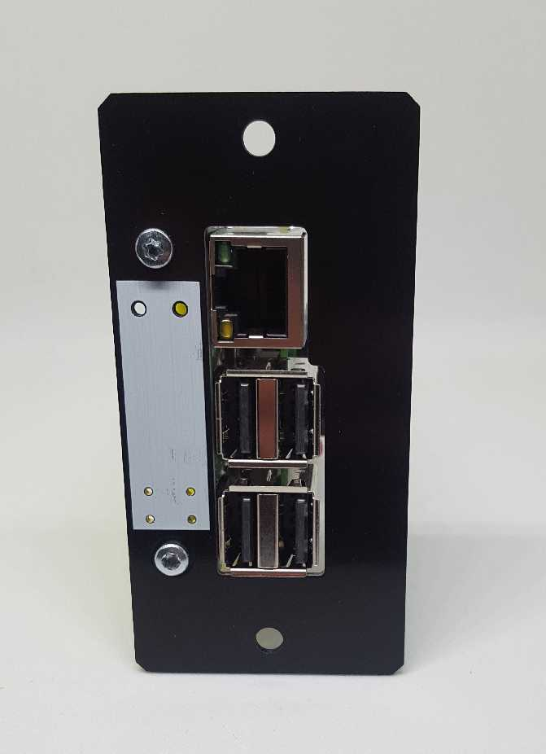
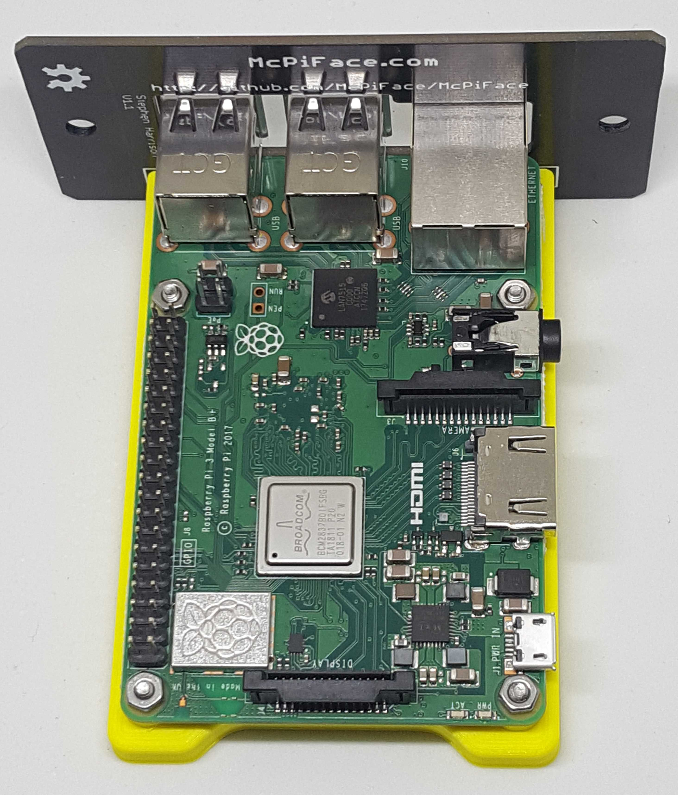
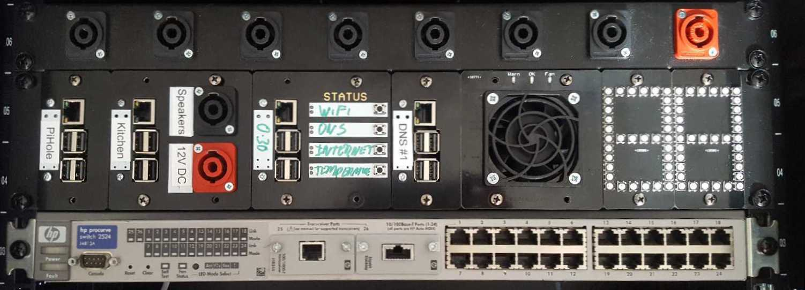

# McPiFace

A Simple front panel for a raspberry pi to allow for blade style rack mounting.

## Version 1.1

## Connections

McPiFace has 2 LEDs (red/green) and a push button option. These can be ignored if not required.

Should you wish to use them, the examples assume the front panel connector is wired as follows: 

Black: Pin 39 GND
Red: Pin 40 (BCM 21)
Green: Pin 38 (BCM 20)
Yellow: Pin 37 (BCM 26)

See https://pinout.xyz/ for Raspberry Pi header pinout.

## Python Code

The Examples folder contains sample Python code to interact with the LEDs and buttons.

The McPyFace.py script can be run to monitor the Pi's temperature and change the red/green LED when it gets hot, as well as shutdown or reboot the Pi when the button is pressed.

This file should be called from rc.local at startup. Instructions are given in the file to configure this and set permissions.

## Sled

To mount the raspberry Pi a 3D printable sled is available:

https://www.thingiverse.com/thing:3488157

## Rack Mount Frame

DAP Audio 2 HE Rackblende f. Modulsystem 10 Segmente MP-1 from Music Store.

* UK: https://www.dv247.com/en_GB/GBP/DAP-Audio-2-HE-Rackblende-f-Modulsystem-10-Segmente-MP-1/art-PAH0017160-000

* Germany: https://www.musicstore.de/en_US/USD/DAP-Audio-2-HE-Rackblende-f-Modulsystem-10-Segmente-MP-1/art-PAH0017160-000

## Version History

V1.0 - had Leds "hidden" in the vent grill and no button.
V1.1 - adopted common LED/button layout used across other McPiFace front panels.